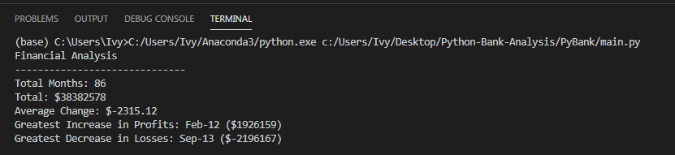
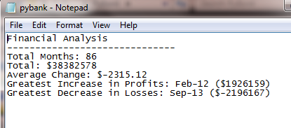

# Python-Bank-Analysis
In this challenge, you are tasked with helping a small, rural town modernize its vote-counting process. (Up until now, Uncle Cleetus had been trustfully tallying them one-by-one, but unfortunately, his concentration isn't what it used to be.)

This is a screenshot of the results in the terminal:

This is a screenshot of the results in the text file:

