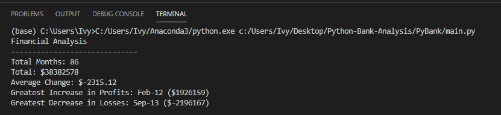
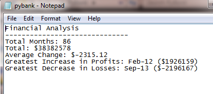

# PyBank Challenge
In this challenge, you are tasked with creating a Python script for analyzing the financial records of your company. You will give a set of financial data called budget_data.csv. The dataset is composed of two columns: Date and Profit/Losses. (Thankfully, your company has rather lax standards for accounting so the records are simple.)

Your task is to create a Python script that analyzes the records to calculate each of the following:
The total number of months included in the dataset
The net total amount of "Profit/Losses" over the entire period
The average of the changes in "Profit/Losses" over the entire period
The greatest increase in profits (date and amount) over the entire period
The greatest decrease in losses (date and amount) over the entire period

# Analysis of Results

Our data covers a period of 86 months (7 years and 2 months). The net total amount of profits/losses was $38,382,578, indicating that the company’s revenue was that much greater than its expenses during this time period. The average of the changes in profits/losses over the entire period is  $-2315.12,   showing that the company was actually losing money month-to-month on average. This seems contradictory that the net total is such a high positive amount, despite the average change amount being a negative number. Looking at the greatest increase in profits, this happened in Feb 2012 when the profit increase was $1,926,159. The greatest decrease in profits happened the next year in Sep 2013 when the profit decrease amount was $-2,196,167. The fact that this profit decrease amount was greater than the profit increase contributes to the average change in profits/losses being in the negative. Overall, the company’s financial situation is doing very well, with net profit totaling over $38M during this 7+ year period, despite the average change per month during this period was negative. 

# Screenshot of my results in the terminal:

# Screenshot of my results in the included text file "pybank.txt":

